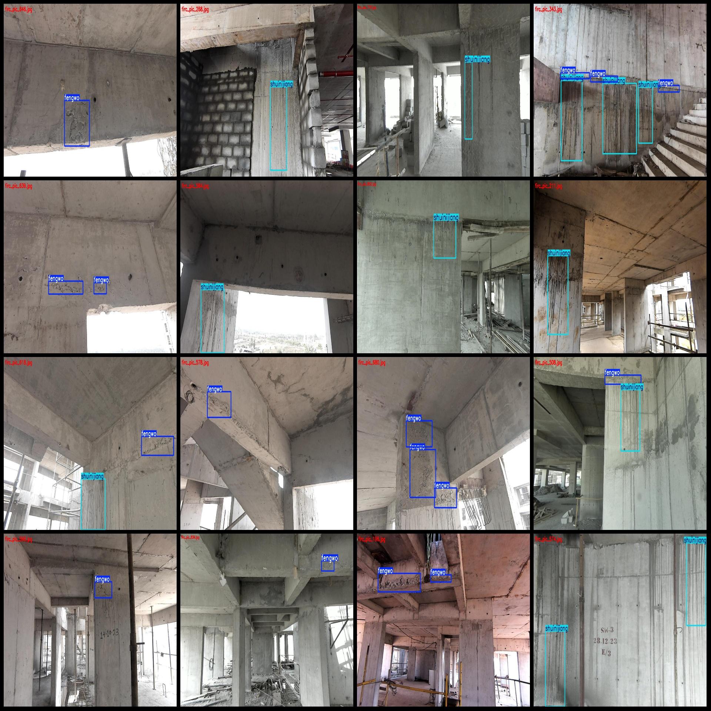
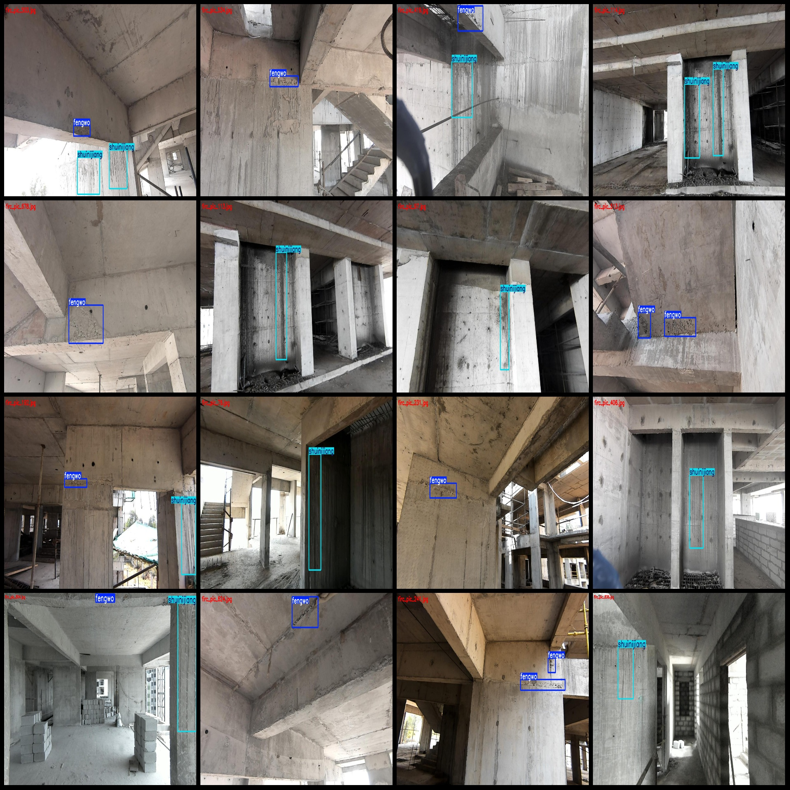

# Bridge Pile Construction Quality Detection Dataset in VOC+YOLO format, 876 images, 2 classes

Dataset format: Pascal VOC format + YOLO format (txt files without split paths, only containing jpg images along with their corresponding VOC format xml files and YOLO format txt files)

Number of images (jpg file count): 876
Number of annotations (xml file count): 876
Number of annotations (txt file count): 876
Number of annotation categories: 2
Annotation category names: ["fengwo", "shuinijiang"]

Each category has the following number of bounding boxes:
- fengwo (cellar) = 862
- shuijinjiang (cement) = 633
Total bounding box count: 1495

Each category occupies a certain number of images:
- fengwo (cellar) occupies 571 images
- shuijinjiang (cement) occupies 427 images

Image resolution: 1280x720

Annotation tool used: labelImg
Annotation rules: draw bounding boxes for each category

Important note: The dataset does not have been divided into training, validation, or test sets; you need to divide them yourself.
Special declaration: This dataset does not guarantee the accuracy of the trained model or the weight files.

Image preview:
Annotation example:
## Image

Here is a pay link on Stripe ( https://buy.stripe.com/3cs8yP7sY87d0vu9AB ). Please contact me lonlonago@foxmail.com after funding $89, and I will send you a complete data files , thank you!

